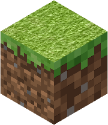

# MinecraftBE-TestingtheRDGraphicsLimit

Trash test...

## Options Overview

|fn|Resolution:         |memory_tider|RAM(Forecast)|TrueRes|
|--|--------------------|------------|-------------| ----- |
| 1|**SUPER LOW**       |2           |1GB          |  1028 |
| 2|LOW                 |2           |1GB          |  2048 |
| 3|MEDIUM              |2           |2GB          |  4096 |
| 4|**HIGH**            |16          |4GB          |  8192 |
| 5|SU5PER **HIGH**     |32          |8GB          |  8193 |
|51|SUPER **HIGH +1???**|32          |?GB          | 16384 |
| 6|Is INSANEEEEEEEEEEEEEEEE, IMPOSSIBLE! You are too STRONG                  | 64         |16GB         | 32768 |

## LMAO

- If you see §lWHITE §r(any color is fine, as long as §cit's not §l§8BLACK§r) then §l§aIT WORKS!

> [!WARNING]
> Should'nt be **SUPER LOW** 
> Results from each version may not be the same/exact.

